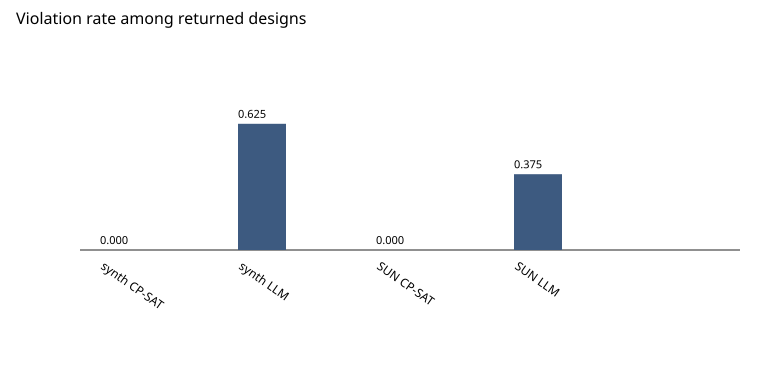

# Phase 11: evaluation and ablation

This report measures the system that Phases 0-10 already built.
It does not replace the page, retrain a model, or change the solver.

## Limitation

Geometry accuracy is measured on public NYU Depth V2 and SUN RGB-D data,
not on a custom tape-measured photo set. There is no personal tape-measure set
on disk. Structured3D perspective RGB and depth are not on disk and were not
downloaded.

## What this run is

- Command: `uv run python scripts/eval_ablation.py`
- Seed: 20261001
- Synthetic rooms: 16
- SUN RGB-D layout rooms: 8

Synthetic rooms are a new draw from the existing generator, seed 20261001, count 16. They are not the Phase 3 gate's 200 rooms. Eligible SUN test rows before the rectangle filter: 190. Skipped missing or implausible layouts while filling the sample: 2. Rooms used: 8.

## Previously recorded

These numbers were already written in docs/reports/. This phase did not rerun them.

Phase 3 gate, seed 20260930, 200 rooms (optimizer_stage1.md): 109 feasible, 91 infeasible, checker violations 0, budget breaches 0, median solve 4.141 ms.
Phase 4 Pareto gate, same seed (optimizer_stage2.md): the same 109/91 split, violations 0, budget breaches 0, dominated pairs 0. 102 of 109 sets have 4 to 8 points. 7 sets return fewer because fewer non-dominated designs exist.
Phase 4 recommender, seed 20260929, 200 queries, 197 scored: Precision@5 0.459, Precision@10 0.361, NDCG@5 0.748, NDCG@10 0.766.
Phase 6 parser, seed 20260930, 100 gold requirements: schema-valid rate 1.000, field-level accuracy 0.470833, text-grounded field accuracy 0.936667.
Phase 6 Recall@5: 0.966667 (29 of 30).
Phase 7a, seed 20260930: classifier test top-1 0.7492 (248 of 331). Detector test mAP50 0.558 and mAP50-95 0.434 against zero-shot 0.343 and 0.260.
Phase 7b depth, NYU test, 654 frames: AbsRel 0.2132, RMSE 0.6199 m, delta1 0.6771, AbsRel after median scaling 0.0741.
Phase 7b segmentation: mean IoU 0.3466 on 64 leak-free NYU test frames.
Phase 7b SUN RGB-D layouts: 473 of 1006 scored. Metric-depth-only median error on the visible part: length 96 cm, width 105 cm, height 44 cm.
Phase 8, 8 rooms, budget +10%: median full re-run 5.332 ms, median warm start 6.040 ms, diffs correct 8 of 8. Warm start was slower. Trace-grounded explanations 96 of 96 (rate 1.0). No trace access 8 of 16 (rate 0.5). qwen2.5:7b, temperature 0.
Phase 9 mask-lock SSIM: 4 rooms at 128 px, mean 1.0, min 1.0, changed_pixels_min 2071. One 512 px diffusion image: locked-region SSIM 1.0, consistency 0 of 1. That consistency figure is one image, not a large set. Critic advisory, 3 disagreement lines, design unchanged. Diffusion-worker peak 3409.3 MiB. nvidia-smi peak 6647 MiB of 8188 MiB.
Phase 10: Playwright 2 passed (1280x900 and 390x844). That run is the page check. This phase did not change the page.

## Ladder

### Step 1: requirement parsing plus diffusion only

Parsing ran on the synthetic sentences in this sample. Diffusion-only and a commercial RoomGPT call did not run. The live generator is Stable Diffusion 1.5 inpainting with ControlNet-depth on an existing design, not an image from text alone.

### Step 2: plus the CV scene graph

On synthetic rooms the scene is the generator, not a photo. On SUN RGB-D the scene is the annotated floor rectangle, not a new perception pass. NYU layout was not run. Phase 7b geometry numbers are cited as previously recorded.

### Step 3: plus RAG numbers recorded beside the parse

Retrieval ran and the numbers were recorded beside the requirement. They were not applied inside CP-SAT, so this step does not change the layout metrics of step 4.

### Step 4: plus CP-SAT instead of an LLM coordinate guess

CP-SAT and an LLM coordinate guess both ran on the same rooms and the same catalog shortlist rules. The guess is qwen2.5:7b, temperature 0.

### Step 5: plus the advisory critic

The advisory critic ran on plan images. Disagreements were logged. Designs were left unchanged. A loop that rejects or rewrites a design did not run.

### Step 6: full system (explanation, Pareto, counterfactual)

This sample has a Pareto set and a counterfactual where those sections below are filled. Trace-grounded explanation faithfulness is the previously recorded Phase 8 result (96 of 96 versus 8 of 16). It was not rerun.

## Synthetic layouts

Violation rate is the fraction of returned designs with at least one Shapely hard-constraint finding. Clean rate counts a room only when a design came back with no finding, a legal budget, every must-have category, and every must-keep pose. A room with no design is not clean. CP-SAT coordinates sit on the 0.05 m grid. The language-model coordinates are not snapped to that grid. Its cost is the sum of catalog rows it named from a three-item shortlist. It does not invent a price.

### CP-SAT (Stage 1)

| metric | value |
| --- | ---: |
| rooms | 16 |
| designs returned | 12 |
| no design | 4 |
| designs with at least one checker violation | 0 of 12 |
| violation rate among returned designs | 0.000 |
| mean violations among returned designs | 0.000 |
| budget compliant among returned designs | 12 of 12 |
| clean rooms (returned, no violation, budget, must-have, must-keep) | 12 of 16 |
| clean rate over all rooms | 0.750 |
| mean must-have rate among returned designs | 1.000 |
| mean must-keep rate where a keep was required | 1.000 (9 rooms) |
| median footprint-sum / floor area | 0.055 |
| median free-floor ratio | 0.945 |
| clearance-clean among returned designs | 12 of 12 |

Hard kinds among returned designs (a design can raise more than one):

- overlap: 0 of 12
- clearance: 0 of 12
- budget: 0 of 12
- missing: 0 of 12

### LLM coordinate guess

| metric | value |
| --- | ---: |
| rooms | 16 |
| designs returned | 16 |
| no design | 0 |
| designs with at least one checker violation | 10 of 16 |
| violation rate among returned designs | 0.625 |
| mean violations among returned designs | 1.562 |
| budget compliant among returned designs | 16 of 16 |
| clean rooms (returned, no violation, budget, must-have, must-keep) | 6 of 16 |
| clean rate over all rooms | 0.375 |
| mean must-have rate among returned designs | 0.979 |
| mean must-keep rate where a keep was required | 0.423 (13 rooms) |
| median footprint-sum / floor area | 0.062 |
| median free-floor ratio | 0.938 |
| clearance-clean among returned designs | 9 of 16 |

Hard kinds among returned designs (a design can raise more than one):

- overlap: 0 of 16
- clearance: 7 of 16
- budget: 0 of 16
- missing: 8 of 16

## SUN RGB-D test layouts

Eligible SUN test rows before the rectangle filter: 190. Skipped missing or implausible layouts while filling the sample: 2. Rooms used: 8.

These rooms are annotated floor rectangles from the SUN RGB-D test split. The photo pipeline was not re-run, so perception error is not folded into these sizes. Openings are absent, so a door-clearance miss cannot occur here. Confidence is high because the rectangle is the annotation, not a depth estimate. The rectangle is Shapely's minimum rotated rectangle. Phase 7b's published centimetre errors used OpenCV's min-area rectangle and were not recomputed.

### CP-SAT (Stage 1)

| metric | value |
| --- | ---: |
| rooms | 8 |
| designs returned | 8 |
| no design | 0 |
| designs with at least one checker violation | 0 of 8 |
| violation rate among returned designs | 0.000 |
| mean violations among returned designs | 0.000 |
| budget compliant among returned designs | 8 of 8 |
| clean rooms (returned, no violation, budget, must-have, must-keep) | 8 of 8 |
| clean rate over all rooms | 1.000 |
| mean must-have rate among returned designs | 1.000 |
| mean must-keep rate where a keep was required | n/a (0 rooms) |
| median footprint-sum / floor area | 0.066 |
| median free-floor ratio | 0.934 |
| clearance-clean among returned designs | 8 of 8 |

Hard kinds among returned designs (a design can raise more than one):

- overlap: 0 of 8
- clearance: 0 of 8
- budget: 0 of 8
- missing: 0 of 8

### LLM coordinate guess

| metric | value |
| --- | ---: |
| rooms | 8 |
| designs returned | 8 |
| no design | 0 |
| designs with at least one checker violation | 3 of 8 |
| violation rate among returned designs | 0.375 |
| mean violations among returned designs | 0.375 |
| budget compliant among returned designs | 8 of 8 |
| clean rooms (returned, no violation, budget, must-have, must-keep) | 5 of 8 |
| clean rate over all rooms | 0.625 |
| mean must-have rate among returned designs | 1.000 |
| mean must-keep rate where a keep was required | n/a (0 rooms) |
| median footprint-sum / floor area | 0.074 |
| median free-floor ratio | 0.926 |
| clearance-clean among returned designs | 8 of 8 |

Hard kinds among returned designs (a design can raise more than one):

- overlap: 2 of 8
- clearance: 0 of 8
- budget: 0 of 8
- missing: 1 of 8

## NYU Depth V2 test split

Layout ladder not run. 654 NYU test frames are on disk. The layout ladder was not run on them because the cleaned export has no room rectangle and the photo pipeline was not re-run.

Depth and segmentation for this split are the previously recorded Phase 7b numbers above. They were not rerun to raise them.

## Requirement parsing on this sample

This is a new sample. It does not replace the Phase 6 numbers above.

| metric | value |
| --- | ---: |
| sentences | 16 |
| schema-valid | 16 of 16 |
| schema-valid rate | 1.000 |
| field-level accuracy | 0.464 |
| text-grounded field accuracy | 0.917 |
| model | qwen2.5:7b |

## RAG numbers recorded beside the parse

Retrieved numbers were stored beside the requirement. They were not passed
into CP-SAT. Named solver constants were not edited.

| metric | value |
| --- | ---: |
| queries | 16 |
| queries with at least one number | 16 |
| numbers recorded | 192 |
| numbers mapped to a solver constant | 33 |
| mapped numbers that differ from that constant | 33 |
| applied inside CP-SAT | False |

## Pareto sets and counterfactuals on this sample

### Pareto, Synthetic

| metric | value |
| --- | ---: |
| rooms | 16 |
| feasible | 12 |
| infeasible | 4 |
| checker violations | 0 |
| budget breaches | 0 |
| dominated pairs inside returned sets | 0 |
| style backend | openai/clip-vit-base-patch32 |
| median sweep ms | 43.230 |

Points per set: 1 set with 2 points, 7 sets with 4 points, 3 sets with 5 points, 1 set with 6 points.

### Pareto, SUN RGB-D

| metric | value |
| --- | ---: |
| rooms | 8 |
| feasible | 8 |
| infeasible | 0 |
| checker violations | 0 |
| budget breaches | 0 |
| dominated pairs inside returned sets | 0 |
| style backend | openai/clip-vit-base-patch32 |
| median sweep ms | 30.522 |

Points per set: 6 sets with 4 points, 2 sets with 5 points.

### Counterfactual on this sample

Budget plus 10 percent, Stage 1, same catalog. This does not replace the
Phase 8 eight-room latency table.

| metric | value |
| --- | ---: |
| rooms | 8 |
| median full re-run ms | 9.126 |
| median warm start ms | 9.856 |
| diffs correct | 8 of 8 |

On this sample the median warm start was slower than the full re-run.

## Advisory critic

The critic read top-down plans, not diffusion images. It did not reject or
rewrite a design. Phase 9's 0-of-1 consistency rate is a different measurement
and is cited above as one image.

| metric | value |
| --- | ---: |
| plans | 4 |
| plans with at least one disagreement line | 3 |
| disagreement lines | 3 |
| designs unchanged | 4 of 4 |

The runner sends a CP-SAT plan before a language-model plan of the same room.
A repeated scene id is those two plans, not a second critic pass on one image.

- syn_room_00001: vlm flagged missing and the geometric checker did not
- syn_room_00002: vlm flagged missing and the geometric checker did not
- syn_room_00001: vlm flagged missing and the geometric checker did not
- syn_room_00002: no disagreement line

## Human preference

A pairwise sheet for friends and faculty is in docs/reports/preference/. Ratings were not collected. No model score was written into that table.

Image pairs prepared: 6.

Scores collected: no.

## Not run, and why

- Commercial RoomGPT, Interior AI, and Spacely AI were not called.
- Diffusion-only, with no scene graph, was not run. The live path is Stable Diffusion 1.5 inpainting plus ControlNet-depth on a design.
- A second ControlNet and SDXL were not added. Phase 9's consistency rate is one image and was not rerun as a large set.
- Retrieved clearance numbers were not inserted into CP-SAT.
- The critic was not allowed to drop or rewrite a design.
- NYU layout was not run. 654 NYU test frames are on disk as images, depth, and labels. They do not include a room rectangle, and the photo pipeline was not re-run.
- Structured3D perspective images were not downloaded.
- Phase 12 (CubiCasa5K floor-plan parser, COLMAP, GraphRAG) was not started.
- No model was retrained. No catalog, RAG chunk, or embedding was overwritten.

## Plot

Violation rate among returned designs, from this run only:



## Repeat

```
uv run ruff check .
uv run pytest
uv run python scripts/verify_datasets.py
uv run python scripts/check_optimizer_200.py
uv run python scripts/check_pareto_200.py
uv run python scripts/eval_ablation.py
```

The Next.js page was not part of this phase. The Phase 10 Playwright run
is `npm run test:e2e` from `frontend/` (2 passed). It was not repeated here.
