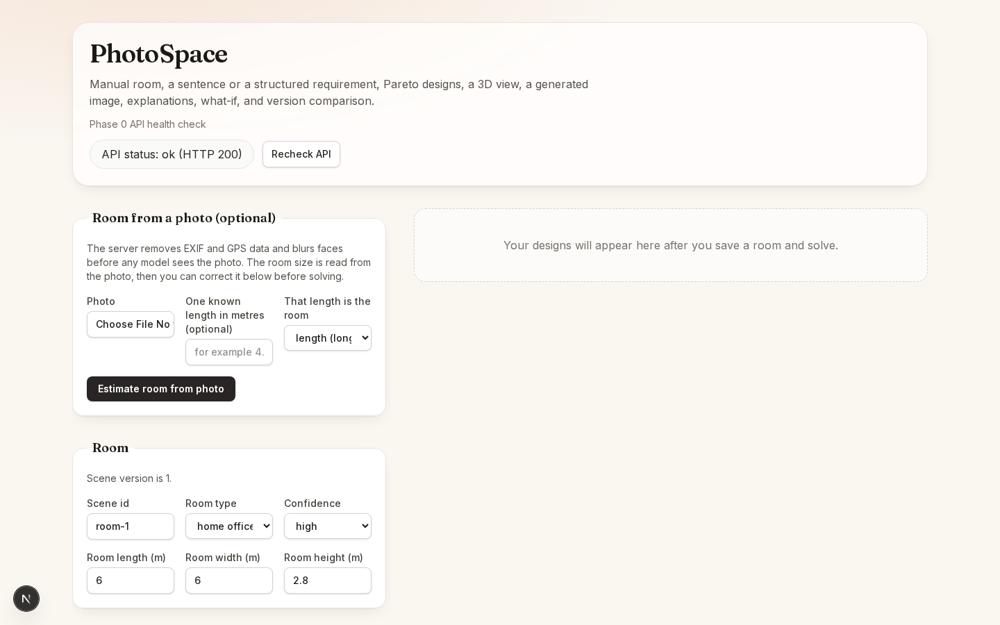

# Optimization and visual refresh

No API contract, route, schema, or migration changed. No commits were made.

## Backend (outputs unchanged)
- `api/main.py`: GZip middleware (responses over 1000 bytes); photo route runs the perception runner and store I/O in `asyncio.to_thread`; the optimize route writes the Pareto set with one `save_designs` call (falls back to `save_design` for stores without it).
- `api/store.py`: new `save_designs` (one transaction, one requirement upsert).
- `recommend/scoring.py`: style scores use one stacked matrix product; empty catalog returns `{}` instead of raising.
- `visualize/backends.py`: a ready diffusion status is cached per process (failures are re-checked so a later install is noticed).
- Not done, on purpose: Ollama keep-alive (urllib to httpx would change error mapping) and CP-SAT catalog pre-indexing (the catalog is already cached; gain was marginal).

## Frontend
- Performance: 3D canvas renders on demand (`frameloop="demand"`, `dpr=[1,2]`, redraw on orbit); `React.memo` on the plan, BOM and Pareto chart; explain and visualize panels are code-split. Not done: narrowing the mesh-load effect dependencies (would need a lint exception).
- Design: warm ivory/terracotta theme via Tailwind v4 `@theme`, Inter + Fraunces through `next/font`, card-style step panels, two-column sticky workspace, hero header, empty state and shimmer skeleton.
- Test fix: the e2e parse-failure message now reads the Sentence alert.

## Results
- `uv run pytest`: 162 passed before, 163 passed after (one new test). `ruff`, `eslint`, `tsc` and `next build` are clean.
- Playwright: desktop and narrow both pass the full flow (4 Pareto points, mesh, generated image, critic, what-if, versions).

